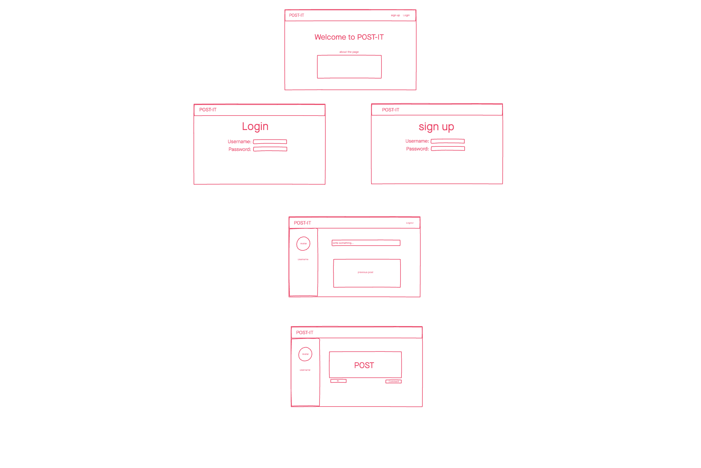
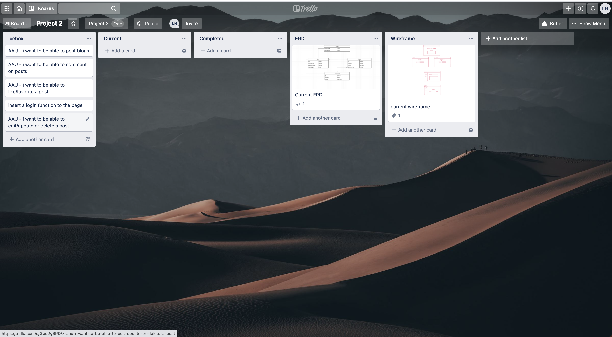
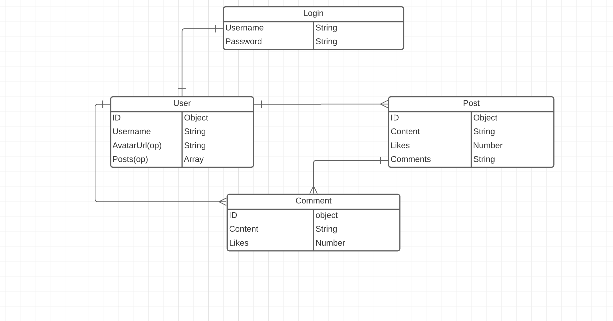

# Post-It

a simple web application where you can post your thoughts, as well as comment on existing posts.

## Technologies Used
- HTML 5
- CSS3
- JavaScript
- Node.js
- Express
- Mongoose/Mongo
- Trello Board
- Wireframe
- Heroku
- Google Fonts

## Screenshots

## Getting started

[Click here]() to see the deployed app!

## Future Enhancements

- user profile page
- posts users name
- enhance the design of the posts page
- add more features (e.g. likes/favorites)
- the ability to upload pictures
- more secure login(email and name)
- make author of the post be the only one to edit

## Explanation
- I used node.js with express to create a an app where the user can create a login and be able to use the app to post or comment within the app. 

- with node.js and express i was able to utilze mongoDB to create a database to store information like users and posts.

- i used CSS to style my page and HTML/ejs to display my information.

## Approach

I use the trello board to design the approach a user would take once inside the app. I was able to design it with a wireframe. With those two ready I was able to move forward with my node.js and express app to input my functionality.
